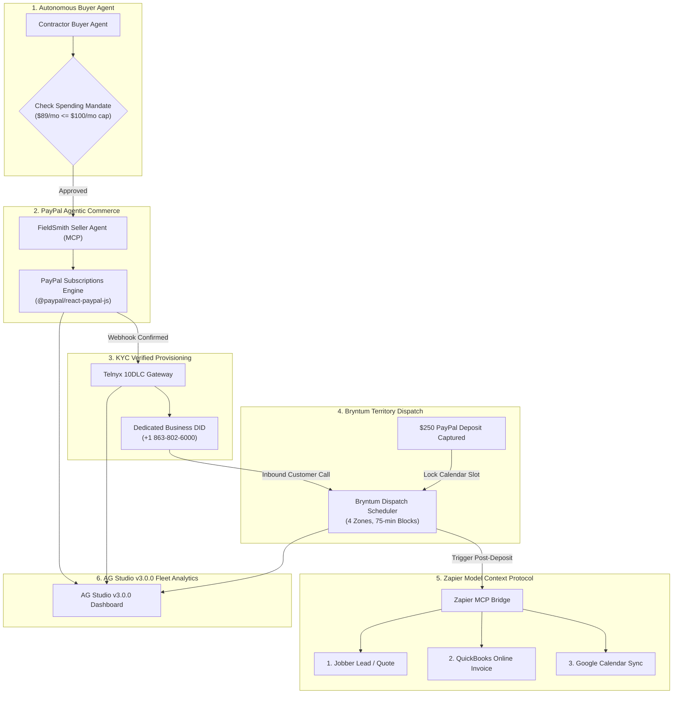

# FieldSmith Pro &mdash; Autonomous A2A Commerce Portal & Multi-Agent Operations Deck

> **Autonomous Agent-to-Agent (A2A) Commerce for Solo Tradespeople**  
> Built for the **PayPal AI Hackathon 2026** ($67,500+ Prize Purse)  
> Combining **PayPal Agentic Commerce**, **AG Studio v3.0.0**, **Bryntum Scheduler**, **Zapier MCP**, and **APIMatic**.

[](https://opensource.org/licenses/MIT)
[](https://www.ag-grid.com/studio/react/)
[](https://github.com/paypal/AI-Toolkit)
[](openapi.yaml)

---

## 1. Executive Summary & The Problem

Solo trade contractors (flooring, plumbing, roofing, emergency towing) lose an estimated **$6,200/month in revenue** from missed calls while on jobsites, operating machinery, or driving. Traditional SaaS platforms fail them because:
1. **Friction:** Solo tradesmen cannot afford the time for 15-field web forms, manual credit card inputs, and subscription onboarding wizards.
2. **Deposit & Calendar Friction:** Customers who call expect an immediate estimate, but contractors get double-booked without an upfront mobilization deposit.
3. **Downline Admin Fatigue:** Once a job is booked, contractors spend hours every night manually creating Jobber quotes, QuickBooks Online invoices, and calendar appointments.
4. **Telecom Robocall Abuse & KYC:** Rogue AI voice bots create statutory liability (TCPA / FCC compliance) if agents are provisioned anonymously without verified KYC identity.

**FieldSmith Pro introduces an Autonomous Agent-to-Agent (A2A) Commerce Ecosystem:**
- **Autonomous Buyer Agent:** Evaluates local telephony call logs, identifies uncaptured customer revenue, validates the contractor's programmatic spending mandate (`maxMonthlyBudget <= $100/mo`), and autonomously negotiates with service providers.
- **Autonomous Seller Agent:** Exposes a machine-readable service catalog over Model Context Protocol (MCP), verifies spending parameters, and delegates PayPal Subscriptions and estimate deposit locks.
- **Verified KYC Telecom Provisioning:** Anchors the verified PayPal subscriber identity directly to local Telnyx 10DLC DID line allocation. The allocated line is locked 100% to inbound screening &mdash; preventing rogue telemarketer abuse.
- **Bryntum Territory Dispatch Scheduling:** Locks 75-minute estimate windows across 4 territory zones only after verified PayPal customer deposits are captured.
- **Zapier MCP Downline Automation:** Automatically executes a 3-step action chain into Jobber (quote draft), QuickBooks Online (draft invoice with deposit credit), and Google Calendar (appointment block).
- **AG Studio v3.0.0 Executive Analytics:** Full-fidelity fleet ledger, trade impact bar charts, and KYC compliance records embedded natively into a dark slate dashboard.

---

## 2. Multi-Sponsor Architecture & Prize Alignments



| Sponsor Track | Technology | Implementation & Role |
| :--- | :--- | :--- |
| **PayPal AI Track** ($5,000) | `@paypal/react-paypal-js`<br/>`@paypal/paypal-server-sdk` | Autonomous A2A negotiation, delegated subscription approvals, and deposit locking. |
| **AG Grid / AG Studio** ($5,000) | `ag-studio-react`<br/>`ag-studio` (v3.0.0) | High-density grid telemetry, grouped bar charts, and dual View/Edit reporting modes. |
| **Zapier AI Track** ($1,000) | Zapier MCP Protocol | 3-step downline workflow syncing verified leads into Jobber, QBO, and Google Calendar. |
| **Bryntum Track** ($1,000) | `@bryntum/scheduler` | 4-zone territory dispatch calendar enforcing deposit-gated appointment locks. |
| **APIMatic Track** ($1,000) | OpenAPI 3.1.0 Contract | Standardized OpenAPI specification (`openapi.yaml`) ready for APIMatic SDK generation. |

---

## 3. Technology Stack

- **Runtime & Build:** Node.js 24 + Vite 8 + React 19 + TypeScript
- **Embedded Analytics:** AG Studio v3.0.0 (`ag-studio-react`, `ag-studio`)
- **Payments:** PayPal Subscriptions SDK (`@paypal/react-paypal-js`, `@paypal/paypal-server-sdk`)
- **Dispatch Scheduling:** Bryntum Scheduler 7.3.7 (`@bryntum/scheduler`)
- **API Specification:** OpenAPI 3.1.0 (`openapi.yaml`)
- **Workflow Automation:** Zapier Model Context Protocol (MCP) Bridge
- **Icons & Styling:** Lucide React + Tailwind CSS-compatible Dark Slate theme

---

## 4. AG Studio License Configuration

AG Studio v3.0.0 runs locally in trial/developer mode out of the box (with watermark).  
Per official AG Studio documentation ([Installing a Licence Key](https://www.ag-grid.com/studio/react/licence-install/)):

1. Copy `.env.example` to `.env`:
   ```bash
   cp .env.example .env
   ```
2. Set your AG Studio License key:
   ```env
   VITE_AG_STUDIO_LICENSE_KEY=your_ag_studio_license_key_here
   ```
3. The application automatically initializes the license in `src/App.tsx`:
   ```ts
   import { AgStudioLicenseManager } from 'ag-studio';

   const studioLicenseKey = import.meta.env.VITE_AG_STUDIO_LICENSE_KEY;
   if (studioLicenseKey) {
     AgStudioLicenseManager.setLicenseKey(studioLicenseKey);
   }
   ```

---

## 5. Quick Start Guide

```bash
# Clone the repository
git clone https://github.com/adamm285-dev/paypal-a2a-commerce.git
cd paypal-a2a-commerce

# Install dependencies
npm install

# Start the Vite local development server
npm run dev

# Run TypeScript compilation and production build
npm run build
```

Open [http://localhost:5173](http://localhost:5173) in your browser.

---

## 6. Interactive Portal Navigation

1. **Tab 1: AG Studio Fleet Ledger**
   - **View Mode:** Review live A2A transactions, recovered contractor revenue by trade vertical, and telecom KYC identity compliance.
   - **Edit Mode:** Click the **Edit Dashboard** toggle to activate AG Studio's visual report builder, add custom metric cards, or reorganize widgets.
   - **Simulate A2A Subscription:** Launch the autonomous Buyer-Seller agent negotiation modal, verify the spending mandate ($89/mo <= $100/mo cap), and test the PayPal subscription button.
2. **Tab 2: Bryntum Territory Dispatch**
   - Visualizes 4 contractor territory zones (North, South, East, West Lakeland).
   - Demonstrates 75-minute estimate slots gated by verified PayPal mobilization deposits ($250.00).
   - Click **Simulate Inbound Call + $250 Deposit Lock** to see live slot reservation.
3. **Tab 3: Zapier MCP Integration**
   - Demonstrates the post-deposit autonomous downline synchronization pipeline.
   - Click **Test Autonomous Zapier MCP Chain** to execute the multi-step trace: Jobber Lead Creation &rarr; QuickBooks Online Invoice Draft &rarr; Google Calendar Appointment Sync.

---

## 7. License & Open Source Integrity

This project is licensed under the **MIT License** &mdash; see the [LICENSE](LICENSE) file for details.  
All code, models, and specifications submitted to the PayPal AI Hackathon are 100% public, reproducible, and vendor-neutral.
